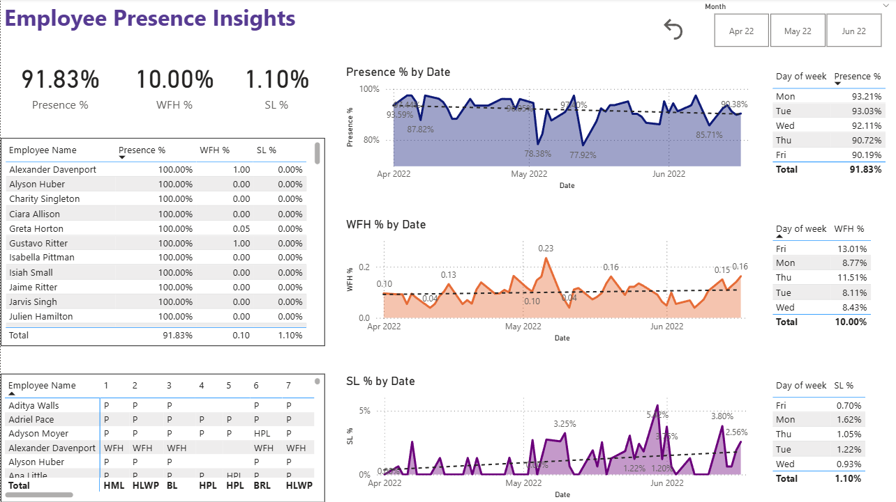

# Employee Attendance Analysis: A Real-World Power BI Project

## Project Context

This project showcases a typical business intelligence scenario: transforming raw, messy, real-world data into an insightful and interactive dashboard. The source data is a common export from an HR system, consisting of separate monthly employee attendance sheets.

The goal is to provide a clear, at-a-glance view of workforce attendance, highlighting key trends in presence, leave, and remote work.

## Dashboard Preview



---

## Important Facts & Key Steps

### 1. Data Source (Real-World Data)

* **Source:** Three separate CSV files, one for each month (**April, May, and June 2022**).
* **Challenge:** The data was in a **wide format** (dates as columns), which is not suitable for analysis. It also contained unnecessary summary columns and inconsistent headers, which is common in raw data exports.

### 2. Data Transformation in Power Query

The primary task was to clean and restructure the data. The most important transformation was **unpivoting** the date columns. This converted the wide table into a long, normalized table with one row per employee, per day.

Other key cleaning steps included:
* Appending the three monthly files into a single master table.
* Splitting employee ID and name into separate columns.
* Merging the data with an `Attendance Key` file to replace codes like `HPL` with meaningful descriptions like "Half day PL".

### 3. DAX for Key Performance Indicators (KPIs)

DAX measures were created to calculate essential business metrics. Instead of just counting rows, these measures add analytical value.

A crucial KPI is the **Attendance Percentage**, which shows the ratio of days an employee was present against their total working days.

```dax
Attendance Percentage =
DIVIDE (
    CALCULATE ( COUNTROWS ( 'Attendance' ), 'Attendance'[Attendance Meaning] = "Present" ),
    CALCULATE (
        DISTINCTCOUNT ( 'Attendance'[Date] ),
        'Attendance'[Attendance Meaning] <> "Weekly Off",
        'Attendance'[Attendance Meaning] <> "Holiday Off"
    ),
    0
)
```

Other important measures calculate totals for **Leave Days**, **Work From Home Days**, and **Sick Days**.

### 4. Technologies Used

* **Technology:** The entire project, from data cleaning to visualization, was completed using **Microsoft Power BI**.
* **Outcome:** An interactive dashboard with slicers for **Month** and **Employee Name**, allowing management to easily filter and analyze attendance patterns for the entire organization or for specific individuals.
